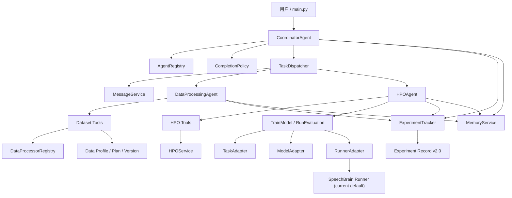

# 自动模型优化系统：运行逻辑、接口与字段说明

## 1. 系统定位

当前系统是一个面向自动模型优化的多智能体框架。现阶段内置：

- `CoordinatorAgent`：选择并调度专业智能体，维护协调实验与完成判定。
- `DataProcessingAgent`：检查数据、生成处理计划、执行和发布数据版本。
- `HPOAgent`：创建 HPO study、生成 trial、训练、评估、早停和晋升候选。

ECAPA-TDNN、SpeechBrain 和声纹验证是当前默认实现，不再是核心协议的固定组成部分。

## 2. 系统结构图



## 3. 整体运行逻辑

1. `CoordinatorAgent.run()` 创建 orchestration 实验，记录任务、模型、执行器和已注册智能体。
2. 协调器调用 `ListRegisteredAgents` 获取可用智能体和动作。
3. 协调器通过统一的 `DispatchAgentTask` 构造 `AgentTaskRequest`。
4. `TaskDispatcher` 校验注册信息、创建智能体并调用 `execute_task()`。
5. 专业智能体执行领域工具，并返回可序列化 `AgentTaskResult`。
6. 调度器生成 `TaskExecutionRecord`，消息和任务结果写入协调实验。
7. `CompletionPolicy` 检查必需智能体是否成功，决定整体状态。
8. 各专业实验通过 `ExperimentService` 和 `ExperimentTracker` 保存统一实验记录。

默认优化顺序通常是：

```text
数据检查 -> 数据处理计划 -> 执行与验证 -> 发布数据版本
-> 创建 HPO Study -> 建议低预算 Trial -> 训练与评估
-> 早停/晋升 -> 最优 Trial -> 完成策略检查
```

## 3.1 代码结构

```text
SR-agent/
├── main.py                         # 命令行入口，构造 CoordinatorAgent
├── configs/                        # 当前模型与评估配置
├── models/                         # 项目自定义模型代码
├── recipes/                        # 当前 SpeechBrain 训练/评估配方
├── agent/
│   ├── agents/
│   │   ├── orchestrator.py         # 协调智能体与通用调度工具
│   │   ├── coordination.py        # AgentRegistry、TaskDispatcher、CompletionPolicy
│   │   ├── communication.py       # AgentTaskRequest/Result 与消息协议
│   │   ├── data_processing_agent.py
│   │   ├── hpo_agent.py
│   │   └── base_agent.py
│   ├── core/
│   │   ├── contracts.py           # OperationRequest/Result、Artifact
│   │   ├── adapters.py            # Task/Model/Runner Adapter 注册与默认实现
│   │   └── experiment_service.py  # OperationResult 统一写入接口
│   ├── data_processing/
│   │   ├── contracts.py           # 数据画像、计划、操作结果、版本结构
│   │   ├── registry.py            # DataProcessor 注册表
│   │   └── service.py             # 检查、计划、执行、验证与发布
│   ├── hpo/
│   │   ├── contracts.py           # SearchSpace、Trial、HPOStudy
│   │   ├── service.py             # Study 与 Trial 生命周期
│   │   ├── strategies.py          # 随机搜索与 Successive Halving
│   │   └── policies.py            # 早停策略
│   ├── memory/
│   │   └── store.py               # 工作记忆、情景记忆和模型记忆
│   ├── tools/
│   │   ├── config_tools.py        # 面向智能体的配置读写工具
│   │   ├── dataset_tools.py       # 通用数据检查、计划、执行、发布工具
│   │   ├── data_processing_tools.py # VoxCeleb/SpeechBrain 专用准备工具
│   │   ├── training_tools.py      # 通用训练入口与结果分析
│   │   ├── evaluation_tools.py    # 通用评估入口
│   │   ├── training_diagnostics_tools.py
│   │   ├── hpo_tools.py
│   │   ├── experiment_history_tools.py
│   │   └── reward_tools.py
│   ├── utils/
│   │   ├── path_tool.py           # 唯一路径解析和目录构造基础层
│   │   ├── experiment_tracker.py  # Experiment Record 持久化
│   │   ├── config_parser.py       # YAML 解析、更新与通用校验
│   │   ├── runner.py              # 当前 SpeechBrain Runner 底层实现
│   │   ├── metrics.py             # 指标提取、计算和比较
│   │   ├── reward.py              # 目标指标到最大化奖励的转换
│   │   ├── logger.py
│   │   └── agent_middleware.py
│   └── prompts/                    # 专业智能体系统提示词
└── speechbrain/                    # 官方 SpeechBrain 库代码，不属于项目业务层
```

结构边界：

- `agents/` 只负责决策、协调和领域任务编排。
- `tools/` 是智能体可调用的稳定接口，负责参数校验并返回可序列化结果。
- `core/` 定义跨模型稳定协议和适配器边界。
- `data_processing/`、`hpo/` 是不依赖 LangChain 的领域服务。
- `utils/` 是底层基础能力，不应依赖具体智能体。
- `runner.py` 和 `data_processing_tools.py` 当前仍属于 SpeechBrain/VoxCeleb 专用实现；扩展其他框架时应新增 RunnerAdapter 或专用工具，而不是继续向通用工具写条件分支。

## 4. 协调通信接口

### AgentTaskRequest

```json
{
  "request_id": "request_xxx",
  "action": "optimize_hyperparameters",
  "objective": "任务目标",
  "context": {},
  "budget": {},
  "experiment_ids": {}
}
```

- `context`：任务输入、前序智能体结果、任务配置。
- `budget`：本次任务允许使用的次数、trial、epoch 或耗时预算。
- `experiment_ids`：关联实验 ID，不用于传输运行时对象。

### AgentTaskResult

```json
{
  "status": "success",
  "summary": {},
  "metrics": {},
  "artifacts": [],
  "recommendations": [],
  "experiment_ids": {},
  "error": null,
  "request_id": "request_xxx"
}
```

所有字段经过 `json_safe` 转换，可直接写文件、进入消息队列或通过远程接口传输。

## 5. 模型执行核心接口

### OperationRequest

```json
{
  "stage": "training",
  "task_type": "speaker_verification",
  "model_family": "ecapa_tdnn",
  "runner": "speechbrain",
  "config_path": "...",
  "data_path": "...",
  "output_dir": "...",
  "parameters": {},
  "context": {}
}
```

### OperationResult

```json
{
  "status": "success",
  "stage": "training",
  "task": {},
  "model": {},
  "execution": {},
  "metrics": {
    "validation": {},
    "test": {}
  },
  "artifacts": [],
  "parameters": {},
  "extensions": {},
  "error": null,
  "experiment_id": "..."
}
```

职责边界：

- `TaskAdapter`：定义主要指标、优化方向并校验指标。
- `ModelAdapter`：校验模型配置。
- `RunnerAdapter`：执行训练/评估，并把框架原始结果转换为 `OperationResult`。
- `ExperimentService`：把 `OperationResult` 写入统一实验记录。

## 6. 实验记录结构

```json
{
  "schema_version": "2.0",
  "experiment_type": "hpo",
  "stage": "training",
  "experiment_id": "...",
  "status": "running",
  "actor": {
    "type": "hpo_agent",
    "name": "model_optimizer"
  },
  "task": {
    "type": "speaker_verification",
    "dataset": "...",
    "primary_metric": "eer",
    "metric_mode": "min"
  },
  "model": {
    "family": "ecapa_tdnn",
    "implementation": "speechbrain",
    "config_path": "..."
  },
  "execution": {
    "runner": "speechbrain",
    "output_folder": "...",
    "trial_id": null,
    "budget": {}
  },
  "metrics": {
    "validation": {},
    "test": {}
  },
  "artifacts": [],
  "parameters": {},
  "extensions": {},
  "tags": {},
  "error": null
}
```

字段规则：

- 核心字段保持模型无关。
- 框架特有内容进入 `extensions.<framework>`。
- 数据生命周期进入 `extensions.data_lifecycle`。
- HPO study 和 trial 摘要进入 `extensions.optimization`。
- 协调任务记录和完成判定进入 `extensions.orchestration`。
- `artifacts` 中的每项使用 `type/name/path/metadata`。

## 7. 数据处理字段

主要结构：

- `DatasetSpec`：数据集 ID、类型、来源、格式、任务、版本、split 和 metadata。
- `DataProfile`：样本数、schema、分布、质量指标、问题列表和扩展信息。
- `DataProcessingPlan`：数据集、操作列表、验证规则和目标。
- `DataOperationResult`：操作状态、输入输出版本、前后指标、产物和错误。
- `DatasetVersion`：版本、父版本、操作历史、质量指标和产物。

处理计划执行结束后会实际检查 `validation_rules`。验证失败时追加一个失败的 `validate_plan` 结果，禁止发布数据版本。

## 8. HPO 字段

- `SearchParameter`：参数名、类型、上下界、候选值、尺度和条件。
- `SearchSpace`：参数列表与约束。
- `Objective`：指标、`min/max` 方向和权重。
- `TrialBudget`：阶段、epoch、数据比例和最大耗时。
- `Trial`：参数、预算、状态、指标、中间指标、成本、产物和停止原因。
- `HPOStudy`：策略、搜索空间、目标、预算阶梯、trial 列表和最佳 trial。

创建 Study 时会校验策略、目标方向、缩减因子、trial 数量和预算合法性。

## 9. 扩展到其他模型

以新增 PyTorch 分类模型为例：

1. 实现并注册任务适配器：

```python
class ClassificationTaskAdapter:
    task_type = "classification"
    primary_metric = "accuracy"
    metric_mode = "max"

    def validate_metrics(self, metrics): ...

register_task_adapter(ClassificationTaskAdapter())
```

2. 实现并注册模型适配器：

```python
class ResNetAdapter:
    model_family = "resnet"
    implementation = "pytorch"

    def validate_config(self, config): ...

register_model_adapter(ResNetAdapter())
```

3. 实现并注册 Runner：

```python
class PyTorchRunnerAdapter:
    runner = "pytorch"

    def run_training(self, config_path, overrides): ...
    def run_evaluation(self, config_path, model_path, data_path, overrides): ...
    def normalize_training_result(self, raw): ...
    def normalize_evaluation_result(self, raw): ...

register_runner_adapter(PyTorchRunnerAdapter())
```

4. 创建协调器或专业智能体时传入：

```python
CoordinatorAgent(
    task_type="classification",
    model_family="resnet",
    implementation="pytorch",
    runner="pytorch",
    config_path="configs/resnet.yaml",
)
```

命令行入口也支持 `--task-type`、`--model-family`、`--implementation` 和 `--runner`。

5. 数据类型需要新操作时，实现 `DataProcessor` 并调用 `register_processor()`。

## 10. 本次字段审查与修正

已修正：

- `ExperimentTracker(experiments_dir=...)` 创建、读取和历史记录未统一使用自定义目录。
- 自定义实验目录删除记录时可能更新全局历史而不是自定义历史，现已按 Tracker 目录隔离删除。
- 不同 `ExperimentTracker` 实例可能在同一秒生成相同实验 ID，现改为在目标目录中检查唯一性。
- 实验记录默认字段强绑定 ECAPA、SpeechBrain 和声纹验证，默认值改为通用值；专业智能体显式写入自身任务和模型字段。
- `TrainModel` 固定调用 SpeechBrain，改为通过注册的 Task/Model/Runner 适配器解析和执行。
- `RunEvaluation` 固定调用 SpeechBrain 和固定 HPO 目录，改为根据实验记录选择 Runner 和实验类型。
- `RunEvaluation` 的适配器或路径异常可能直接抛出，现统一转换为失败的 `OperationResult`。
- 普通 checkpoint 候选错误地选择最旧文件，改为选择最新文件。
- `OperationRequest` 缺少序列化接口，已增加 `to_dict/to_json`。
- 数据处理 `validation_rules` 未执行，现已在计划执行结束后检查。
- 无操作结果也能发布数据版本，现已禁止。
- HPO Study 缺少基础参数合法性检查，现已补充。
- 旧 `EvaluateModel` 的主入口统一委托给结构化 `RunEvaluation`。
- `MetricsCalculator.get_best_epoch` 依赖文件末尾隐式导入的 `numpy`，现改为标准 Python 选择逻辑。
- EER/minDCF 计算直接对 Python list 做数组比较会报错，现先转换为 NumPy 数组；日志最终指标改为读取最后一次匹配值。
- 实验指标比较过去默认所有指标越小越好，现支持 `min/max`，并从任务主指标读取方向。
- 历史比较过去只能读取 `metrics`，无法比较协调层 `rounds` 等字段，现支持普通字段、点路径和 orchestration 扩展字段。
- 训练诊断工具固定读取 SpeechBrain 扩展和 HPO 目录，现按实验类型读取，并支持任意 Runner 提供的 `training_history`。
- 训练诊断与奖励工具的主要结果改为结构化 JSON，便于智能体继续决策。
- HPO 历史基线奖励和奖励工具现根据任务主指标及 `min/max` 方向计算，不再只支持 EER。
- `ConfigParser.validate_config` 原本要求 ECAPA 专用结构，现仅做通用配置校验，模型专用校验交给 `ModelAdapter`。
- `ResetConfig` 可能恢复其他配置文件的最早备份，现按当前配置文件名筛选备份。
- 数据准备缓存原来仅使用 `train/eval` 名称，可能跨数据集误复用；现根据数据和处理参数生成缓存键。
- VoxCeleb CSV 统计原来一次性读取全部文件，并固定记录 train/dev；现使用流式计数并按实际 split 收集清单。
- 路径工具补充空路径拼接、目标父目录创建、负数备份保留数等边界校验。
- 日志写入增加线程锁，工具中间件会记录工具异常后继续抛出，避免并发日志交叉和失败缺少记录。

## 11. 后续建议

下一阶段应优先完成：

1. 使用通用 `OrchestrationGoal` 替换协调器入口中的 `target_eer`。
2. 将 `RunnerAdapter` 的实现拆到独立 `runners/` 目录。
3. 为训练日志解析增加 Runner 专属解析器，移除训练工具中的 SpeechBrain 日志正则。
4. 增加协议级单元测试，校验所有 Request、Result 和 ExperimentRecord 均可 JSON 序列化。
5. 增加 `BudgetPolicy` 与 `DecisionPolicy`，避免只依赖大模型决定调用次数和后续动作。
