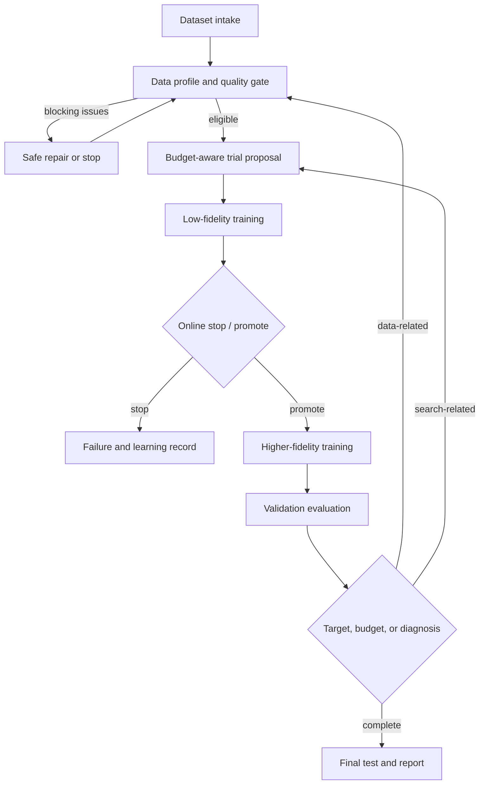

# SR-agent 系统优化与论文级实验计划

> 文档状态：研究与工程实施草案，供方案筛选和后续修改使用  
> 生成日期：2026-08-05  
> 目标：把当前 SR-agent 从“可运行的多智能体 HPO 工程框架”推进为“可验证、可复现、具有明确方法贡献的自动模型优化系统”  
> 重要边界：本文档不假设任何尚未完成的实验结果，也不保证达到 ICLR 录用标准。

## 1. 执行摘要

当前系统已经具备注册表、统一任务消息、结构化实验记录、数据交接、模型/任务/运行器适配器、HPO 调度器和 FakeRunner 测试基础。主要问题不是缺少更多抽象，而是以下三个研究与工程缺口：

1. 数据处理智能体能够发现和修复的问题太少，尚不能证明它改善了训练输入或下游性能。
2. HPO 的一次 trial 仍主要执行“完整训练后完整评估”，已有早停策略不能实时中断训练，因而节省算力的效果有限。
3. 协调智能体仍以固定顺序执行组件，没有形成“数据质量、训练反馈、资源预算、历史记忆”共同驱动的有界闭环。

推荐的核心研究方向不是泛化地宣称“多智能体能够自动优化模型”，而是聚焦一个可证伪命题：

> 在固定计算预算下，采用结构化数据质量门控、在线多保真调度和作用域受控记忆的闭环优化系统，能否以更少的 GPU 成本达到不差于或优于经典 HPO 的最终模型质量？

当前代码已经完成 L1，即 LLM 能够生成结构化候选建议并由策略层校验。下一步直接建设 L2：让 LLM 在确定性安全边界内自主决定参数候选、trial 晋升、搜索空间调整和剩余预算重分配，合法决策无需人工确认即可执行。硬预算上限、测试集隔离、参数合法性、文件安全、最大循环次数和实验审计仍由确定性策略控制。

## 2. 论文定位筛选

### 2.1 三种可选定位

| 路线 | 核心主张 | 所需证据 | 风险 | 建议 |
|---|---|---|---|---|
| A. 工程系统 | 构建了统一的多智能体声纹模型优化平台 | 接口、可运行性、案例展示 | 对 ICLR 主会的方法贡献通常不足 | 可作为工程基础，不建议作为最终主张 |
| B. 预算感知 HPO | 多智能体控制器提升 HPO 的 anytime performance 和计算效率 | 等预算基线、早停、消融、多模型结果 | 容易被认为是现有 BOHB/ASHA/TPE 的系统封装 | 可行，但必须提出清晰的新决策机制 |
| C. 数据质量感知的闭环 AutoML | 数据质量决策与 HPO 反馈联合控制，在固定预算下减少失败和无效 trial | 数据缺陷基准、联合优化、路由消融、等预算 HPO | 实现与实验更复杂 | 推荐主线，最可能形成非平凡研究问题 |

### 2.2 推荐的论文边界

第一篇论文建议将任务边界限定为 speaker verification，并在 ECAPA-TDNN、ResNet speaker model 和 x-vector 上验证模型泛化。只有在第二类任务上得到完整结果后，才使用“model-agnostic”或“domain-general”表述。

若只完成声纹模型实验，建议使用：

- `model-extensible speaker verification optimization system`
- `data-quality-aware and budget-aware HPO for speaker verification`

不建议直接使用：

- `general-purpose AutoML`
- `universal model optimization`
- `fully autonomous AI scientist`

### 2.3 投稿前必须通过的新颖性门槛

在进行大规模 GPU 实验前，完成一次系统文献检索，至少覆盖：

- multi-fidelity HPO：Successive Halving、ASHA、Hyperband、BOHB；
- Bayesian optimization：TPE、Gaussian-process BO、multi-objective HPO；
- agentic AutoML 和 LLM-assisted HPO；
- data-centric AI、数据质量评估和自动数据修复；
- learning-curve extrapolation、early termination 和 warm-start HPO；
- memory-augmented agents 与负迁移控制。

通过条件：能够用一页文字明确写出“现有方法做什么、不能做什么、本文新增哪个决策变量或反馈机制”。如果最终差异只是“用 LangGraph 调用了 Optuna 和 SpeechBrain”，应停止 ICLR 主会定位，转向软件、系统或领域应用投稿。

## 3. 研究问题与可证伪假设

### RQ1：数据处理智能体是否能可靠发现并修复训练相关的数据问题？

- H1.1：对预先注入且具有确定标签的数据问题，关键错误召回率达到 100%，总体 precision/recall 不低于 0.95。
- H1.2：修复后数据能够通过下游加载和训练 smoke test，且不改变原始数据。
- H1.3：在同一训练配置下，修复数据相对受污染数据降低训练失败率，并改善或恢复验证指标。

### RQ2：低保真指标是否能够预测完整训练后的模型排序？

- H2.1：选定代理指标与完整验证 EER 的 Spearman 相关系数达到预注册阈值，建议 `rho >= 0.60`。
- H2.2：低保真阶段对最终 top-20% 配置的召回率不低于 0.70。
- H2.3：在线早停误删最终 top-10% 配置的比例不高于 0.10。

如果 H2 不成立，不应继续使用该代理指标进行 aggressive pruning，应改用更高 fidelity 或仅将其用于故障检测。

### RQ3：系统是否在固定预算下优于经典 HPO？

- H3.1：在相同实际 GPU 时间或等价完整训练预算下，系统具有更低的 anytime validation EER 曲线面积。
- H3.2：达到预设目标 EER 的时间显著缩短。
- H3.3：最终测试 EER 至少满足相对最强经典基线的非劣性，并争取显著改善。

### RQ4：数据质量反馈、记忆和动态协调分别贡献了什么？

- H4.1：去除数据质量门控会增加失败 trial 或无效 GPU 调用。
- H4.2：正确作用域记忆能够减少达到同一目标所需的 trial；无关记忆不会优于无记忆，并可能产生可测负迁移。
- H4.3：动态路由相对固定顺序减少不必要调用，同时不降低任务完成率。

### RQ5：方法能否跨模型工作？

- H5.1：核心协议不变时，可通过 ModelAdapter/RunnerAdapter 接入至少三个声纹模型。
- H5.2：效率收益在不同模型上方向一致，而不是只在 ECAPA-TDNN 上出现。

### RQ6：L2 自主决策层是否安全、有效且具有可解释贡献？

- H6.1：L2 的非法参数执行、预算越界、无资格晋升和测试集访问均为 0。
- H6.2：候选参数、晋升、预算分配和搜索策略的每个自动动作都能追溯到结构化证据与决策记录。
- H6.3：在固定硬预算下，完整 L2 系统相对强经典 HPO 基线改善 anytime performance 或 time-to-target，同时保持最终指标非劣。
- H6.4：LLM 不可用、输出非法或连续低质量决策时，系统能够自动回退到确定性调度并完成 campaign。

## 4. 推荐方法定义

### 4.1 优化目标

将系统目标定义为带计算约束的联合优化，而不是单纯最小化 EER：

```text
minimize    J(theta, phi; D_val)
subject to  Cost(theta, phi) <= B
            Q(phi(D_train)) satisfies data constraints
```

其中：

- `theta`：模型超参数；
- `phi`：数据检查、过滤、修复或采样策略；
- `J`：验证集主指标，例如 EER；
- `B`：GPU 时间、trial 数或等价完整训练预算；
- `Q`：数据质量约束；
- 测试集只用于最终一次或少量预注册确认，不参与 HPO 决策。

### 4.2 推荐闭环



### 4.3 控制原则

- L1 已在代码层面完成，不作为后续正式实验的单独对照组。
- L2 允许 LLM 自主选择候选参数、晋升 trial、调整搜索空间和重分配剩余预算；合法决策由系统自动执行。
- LLM 不能提高 campaign 硬预算上限，不能访问测试指标，不能绕过 ModelAdapter、QualityGate、文件安全和最大循环次数。
- LLM 不直接修改源代码或原始数据；训练、评估和安全数据操作仍通过注册工具与事务化执行器完成。
- 所有 L2 决策必须通过 schema、参数约束、候选资格、预算、数据版本和权限策略校验。
- 相同 `dataset_version + code_version + config_hash + fidelity` 的 trial 默认复用结果。
- 每条路由必须有 `reason_code`、输入证据、预算影响和停止条件。
- 所有循环有最大轮数和最大成本，禁止无限自我反思。

### 4.4 L2 受约束自主决策协议

L2 的含义不是让 LLM 绕过工具层直接运行命令，而是让 LLM 成为优化控制平面的决策者：结构化决策一旦通过硬约束校验，系统立即自动执行。推荐统一接口：

```python
@dataclass
class L2OptimizationDecision:
    decision_id: str
    action: str
    reason_codes: list[str]
    evidence: dict
    candidate_parameters: list[dict] = field(default_factory=list)
    promote_trial_ids: list[str] = field(default_factory=list)
    search_space_patch: dict = field(default_factory=dict)
    budget_allocation_patch: dict = field(default_factory=dict)
    expected_gain: dict = field(default_factory=dict)
    confidence: float = 0.0
```

允许的动作限定为：

```text
propose_candidates
promote_trials
reallocate_remaining_budget
refine_search_space
switch_sampler
stop_trial
continue_search
complete_campaign
```

预算调整只能重分配 `remaining_budget`，例如改变 screening 数量、promotion quota、重试额度或 fidelity 比例，不能修改 `campaign_hard_limit`。搜索空间调整只能作用于 ModelAdapter 声明的可变参数，并保持在绝对边界内。

推荐执行链：

```text
DecisionContextBuilder
    -> LLMDecisionProvider
    -> DecisionSchemaValidator
    -> ParameterConstraintPolicy
    -> PromotionEligibilityPolicy
    -> BudgetSafetyPolicy
    -> L2DecisionExecutor
    -> DecisionAuditRecorder
```

每次决策都保存 `proposal`、`accepted_fields`、`rejected_fields`、`executed_actions`、`budget_before`、`budget_after` 和 `fallback`。LLM 决策点限制在 campaign 开始、rung 完成、固定数量 trial 完成、失败恢复和剩余预算显著变化时；step/epoch 级早停继续由确定性策略执行。

## 5. 分阶段工程计划与准入门槛

## 阶段 0：冻结协议与测试基线

### 目标

在不使用 GPU、外部 LLM 和真实训练的情况下，证明基础接口、字段、记录、通信和状态机可靠。

### 修改范围

- 为 `AgentTaskRequest`、`AgentTaskResult`、`OperationResult`、`ExperimentRecord`、`DatasetVersion`、`Trial`、`MemoryRecord` 固定 schema version。
- 建立 JSON round-trip、旧记录迁移和非法字段测试。
- 扩展 FakeRunner，使其支持：训练曲线、可控失败、超时、NaN、OOM、代理指标、评估调用计数和停止回调。
- 增加统一事件：`trial_started`、`metric_reported`、`trial_pruned`、`evaluation_started`、`trial_completed`。
- 固定随机种子，并记录 Python、依赖、Git commit、配置和数据 manifest hash。

### 验收实验 E0：无 GPU 契约与故障注入测试

设计：对每个公共接口进行正常、缺字段、错误类型、未知版本和重复消息测试；使用 FakeRunner 注入训练失败、评估失败、超时和中断恢复。

指标：

- 测试通过率；
- 未捕获异常数；
- 重复消息导致的重复执行数；
- 预算越界次数；
- 记录恢复成功率。

进入下一阶段的硬门槛：

- 所有 unit/integration 测试通过；
- 0 个真实 GPU/LLM 调用；
- 0 个 schema 未捕获错误；
- 重放同一 request 不产生重复 trial；
- 中断恢复后实验记录保持一致。

设计理由：后续效率和性能实验依赖准确计数、恢复和记录；基础层不稳定时，任何 GPU 结果都无法可信归因。

## 阶段 1：增强数据处理智能体

### 目标

将数据处理智能体从“读配置并执行少量处理函数”提升为“可检测、可解释、可安全修复、可阻断训练的数据质量控制器”。

### 通用核心接口

```python
class DataProfiler(Protocol):
    data_type: str
    def profile(self, dataset: DatasetSpec, policy: QualityPolicy) -> DataProfile: ...

class DataProcessor(Protocol):
    operation_name: str
    supported_data_types: set[str]
    def preview(self, dataset: DatasetSpec, parameters: dict) -> OperationImpact: ...
    def execute(self, dataset: DatasetSpec, parameters: dict) -> DataOperationResult: ...

class QualityGate(Protocol):
    def evaluate(self, profile: DataProfile) -> QualityDecision: ...
```

### 首批音频/声纹指标

| 类别 | 指标或问题 | 处理建议 |
|---|---|---|
| 文件完整性 | 不存在、空文件、不可解码、路径越界 | 阻断或过滤 |
| 音频属性 | 时长、采样率、声道、编码格式 | 过滤、重采样或格式修正 |
| 信号质量 | 静音率、削波率、异常幅值、近零能量 | 标记、过滤或重新生成 |
| 标签质量 | 缺失 speaker ID、非法标签、重复样本 | 修正 manifest 或阻断 |
| 分布质量 | 每说话人样本数、时长分布、长尾程度 | 分层采样或报告风险 |
| 数据泄漏 | train/valid/test 说话人或文件重叠 | 必须阻断 |
| 验证协议 | trial 文件有效性、正负样本比例、重复 pair | 修正或阻断 |

### 首批安全操作

- `validate_audio_files`
- `normalize_manifest`
- `filter_unreadable_audio`
- `filter_by_duration`
- `check_speaker_split`
- `build_debug_subset`
- `validate_verification_trials`
- `publish_dataset_version`

默认不原地修改数据。所有操作先 `preview`，输出受影响样本数和估计磁盘开销；处理结果写入新版本目录，并保存父版本、参数和文件 hash。

### 验收实验 E1：可控数据缺陷检测基准

数据构建：从训练数据中创建只含 manifest、元数据或少量音频副本的隔离 fixture。按 5 个随机种子注入问题，建议每类问题采用 1%、5%、10% 三种污染率。注入类型至少包括：

1. 缺失路径；
2. 空文件；
3. 截断或不可解码音频；
4. 极短音频；
5. 采样率不一致；
6. speaker ID 缺失或错误；
7. 重复记录；
8. train/valid speaker leakage；
9. 无效 verification pair；
10. 高静音或削波样本。

对照方法：

- B0：不检查；
- B1：当前通用文件/CSV 校验；
- B2：扩展后的确定性 profiler；
- B3：确定性 profiler + LLM 建议器，可选消融。

指标：每类 precision、recall、F1、关键错误 recall、误报率、每千文件扫描时间和峰值内存。

门槛：

- 对缺失、不可解码和泄漏等 blocking issue，recall 必须为 1.00；
- 总体 precision 和 recall 均不低于 0.95；
- clean fixture 误报率不高于 1%；
- 同一输入重复扫描结果一致。

设计理由：这些问题具有明确 ground truth，因此应使用高门槛；若确定性错误都无法可靠识别，不能让智能体自动决定训练。

### 验收实验 E2：修复正确性与下游作用

第一部分为无 GPU 测试：验证修复幂等性、源数据不变、输出可加载、版本 lineage 完整。修复成功率定义为“目标问题消失且未引入新的 blocking issue”的样本比例，门槛建议不低于 0.98。

第二部分为小规模 GPU 实验：固定模型、超参数、数据划分和随机种子，比较：

- clean data；
- corrupted data；
- automatically repaired data；
- manually repaired oracle data。

报告训练启动成功率、有效样本数、训练吞吐、验证损失、验证 EER 和最终测试 EER。至少 3 个训练种子。

进入下一阶段的条件：自动修复结果能够恢复至 oracle 修复结果的合理范围，且不会比 clean data 引入显著退化。非劣性容差必须在看到主结果前根据 pilot 方差预注册。

## 阶段 2：建立真正可中断的多保真训练

### 目标

让早停发生在训练期间，并将完整 EER 评估限制在有潜力的配置上。

### 修改范围

- RunnerAdapter 增加 metric callback、heartbeat 和 stop signal。
- 训练每个 epoch 或固定 step 上报 `intermediate_metrics`。
- 分离 `screening_metric`、`promotion_metric` 和 `final_metric`。
- 增加 trial fingerprint、结果缓存和断点恢复。
- 将预算统一记录为 epoch、data fraction、wall-clock、GPU-seconds 和等价完整训练单位。

### 等价完整训练单位

定义一个 full-training equivalent，记为 FTE：

```text
nominal_FTE = data_fraction * epochs / full_epochs
```

该值只能用于预先分配预算，不能替代实际 GPU 成本。主结果必须同时报告真实 GPU-hours、wall-clock 和评估开销，因为不同 fidelity 的初始化、I/O 和验证开销并不线性。

### 验收实验 E3：代理指标校准

从同一个预注册搜索空间用 Sobol 或固定随机设计采样配置。建议：

- pilot：12 个配置；
-最低可信：20 个配置；
-较强证据：30 个或更多配置。

每个配置执行 low、medium、full 三档 fidelity，并保存完整 learning curve。候选代理指标包括：

- validation loss；
- validation classification error；
- 前若干 epoch 的下降斜率；
- 小规模 verification subset EER；
- 训练稳定性分数；
- 以上指标的预注册组合。

分析：

- Spearman `rho` 和 Kendall `tau`；
- low-fidelity top-k 对 full-fidelity top-k 的 recall；
- 不同 epoch 的排序稳定性；
- 模拟早停的 false-prune rate；
- 相关系数的 bootstrap 95% CI。

采用门槛建议：`rho >= 0.60`、top-20% recall `>= 0.70`、最终 top-10% false-prune `<= 0.10`。若未通过，增加 fidelity、改变代理指标或放弃性能型早停，仅保留 NaN/OOM/明显发散检测。

设计理由：低成本不等于有效。先证明低保真排序能够预测完整结果，才能合理声称剪枝节省了算力且没有系统性错删优良配置。

## 阶段 3：HPO 决策质量与等预算比较

### 目标

在公平预算下比较 proposed system 与经典 HPO，回答效率和最终质量是否真正改善。

### 必须包含的基线

| 编号 | 方法 | 作用 |
|---|---|---|
| H0 | 官方/人工默认配置 | 判断自动优化是否值得 |
| H1 | Random Search | 最低强度、不可省略的随机基线 |
| H2 | TPE，无 pruning | 区分 sampler 收益 |
| H3 | TPE + Successive Halving/Hyperband | 强多保真基线 |
| H4 | BOHB 或等价实现 | 对比成熟预算感知 HPO |
| H5 | SR-agent deterministic，无 LLM | 验证闭环控制器本体 |
| H6 | SR-agent + scoped memory | 验证历史复用 |
| H7 | SR-agent L2 governed control | 验证 LLM 自主候选、晋升、预算与策略决策 |
| H8 | SR-agent L2 component variants | 定位各项 L2 权限的独立贡献 |

在算力不足时，优先保留 H0、H1、H3、H4、H7；不能只和默认配置比较，也不需要把 L1 单独作为正式对照。

### 公平性约束

- 所有方法使用同一搜索空间、训练代码、数据版本、验证集和最大预算。
- 使用相同的初始随机设计或配对 seed。
- 不允许 proposed method 查看测试集或额外完整训练结果。
- LLM 调用时间、token 和费用单独报告；若不计入 GPU 预算，也要计入端到端 wall-clock。
- 失败 trial 消耗的 GPU 时间必须计入预算。
- 所有方法都允许使用相同的 checkpoint 恢复条件。

### 主实验 E4：Anytime HPO 比较

主模型建议使用 ECAPA-TDNN。每种方法运行到统一的最大 FTE 或 GPU-hour 预算，并从同一条运行轨迹读取 25%、50%、100% 预算点，不需要为每个预算重新启动实验。

重复次数：

- pilot：3 个 HPO seed；
-论文最低建议：5 个独立 HPO seed；
-算力允许时：10 个 seed，用于更稳定地估计 HPO 方差。

主指标：

1. incumbent validation EER versus GPU-hours；
2. anytime curve 的归一化面积，越低越好；
3. time-to-target；
4. 最大预算下的 best validation EER；
5. 选定配置重新训练后的 test EER 和 minDCF；
6. 失败率、pruned ratio、完整评估调用数和峰值显存。

最终测试规则：每个 HPO run 只依据验证指标选出一个配置；主表中可对每种方法的预注册选定配置进行 3 次独立完整重训练，再在 VoxCeleb1-O/E/H 上评估。禁止使用 test EER 选择 trial 或调整搜索空间。

阶段通过条件：

- 相对最强经典基线，anytime AUC 的配对差异具有稳定方向，95% CI 不跨越预注册的无效应区间；
- 达到目标 EER 的中位 GPU 时间至少降低 30%，该阈值是工程实用门槛，不代替统计检验；
- 最终 EER 满足预注册非劣性界限；
- 无预算越界、测试集泄漏或未记录失败成本。

如果只节省时间但最终性能略降，应明确报告 Pareto trade-off，不可表述为全面优于基线。

## 阶段 4：L2 自主控制、数据-HPO 反馈闭环和记忆

### 目标

逐步开放 LLM 的实际执行权限，在每一级通过功能、安全和可恢复性验收后再开放下一项权限，最终形成能够自主调整候选、晋升、预算和策略的 L2 闭环。

### L2-A：统一决策协议与权限边界

改善内容：

- 新增 `L2OptimizationDecision`、`DecisionReview`、`DecisionExecutionResult` 和 schema version。
- 建立 `DecisionContextBuilder`，只提供训练/验证证据、剩余预算、eligible trial、允许动作和模型约束。
- 建立权限矩阵，明确每种 action 可读取和修改的字段。
- 建立不可变 `CampaignBudgetLedger`，所有资源先原子预留再执行。
- 建立决策审计、幂等 decision ID、超时、重试和确定性 fallback。

无 GPU 验收：

- 非法 action、未知字段、越界参数、测试指标和超预算 patch 全部被拒绝；
- 同一 decision ID 重放不会重复执行；
- 每次拒绝都有稳定 reason code；
- LLM 超时或 JSON 非法时 campaign 仍能完成。

进入 L2-B 的门槛：越权执行 0 次、重复执行 0 次、预算账本不一致 0 次、审计记录完整率 100%。

### L2-B：参数候选自主生成与自动调度

改善内容：

- LLM 根据搜索空间、历史 trial、失败区域、模型约束和剩余预算生成最多 `k` 个候选。
- `CandidatePolicy` 执行 schema 校验、ModelAdapter 校验、搜索边界检查、参数指纹去重、资源预估和历史失败检查。
- 通过的候选自动创建 trial 并进入调度队列；被部分拒绝时允许执行剩余合法候选。
- 候选不足或连续低质量时使用 TPE/Random fallback 补足队列，避免系统停摆。

无 GPU 验收：使用 FakeRunner 构造合法、越界、重复、OOM 高风险和条件参数组合。

进入 L2-C 的门槛：执行候选合法率 100%、重复配置执行数 0、候选队列不会饿死、fallback 可恢复率 100%、硬预算不被突破。

### L2-C：trial 晋升自主决策

改善内容：

- `PromotionContext` 只暴露 eligible trial ID、代理指标、趋势、稳定性、已耗成本、不确定性和 promotion capacity。
- LLM 只能从 `eligible_trial_ids` 中选择，不能创建或修改 trial ID。
- 支持 LLM 决定晋升数量、保留探索性候选以及是否等待更多曲线信息。
- `PromotionEligibilityPolicy` 负责状态、指标有效性、rung、checkpoint、剩余预算和重复晋升校验。

无 GPU 验收：构造未完成 trial、NaN trial、已晋升 trial、超额晋升和并列指标场景。

进入 L2-D 的门槛：无资格晋升 0 次、重复晋升 0 次、promotion capacity 越界 0 次、所有晋升都有证据和 checkpoint、策略不可用时能回退固定晋升。

### L2-D：剩余预算自主重分配

改善内容：

- LLM 可在新候选、晋升、重试和不同 fidelity 之间重新分配剩余预算。
- `campaign_hard_limit`、已消耗预算和已预留预算不可修改。
- 所有预算 patch 使用事务：validate -> reserve -> execute -> commit/release。
- 同时限制 GPU-seconds、FTE、trial 数、完整评估数和 LLM 调用数，避免单一预算口径被绕过。
- 预算不足时由策略裁剪低优先级动作，不允许隐式透支。

无 GPU 验收：并发预留、执行失败释放、超预算请求、负数预算、重复提交和恢复后账本重建。

进入 L2-E 的门槛：所有预算维度越界 0 次、预留与实际消耗可对账、失败资源释放率 100%、恢复后账本一致。

### L2-E：搜索空间与策略自主调整

改善内容：

- LLM 可缩放参数范围、冻结参数、调整 categorical choices、切换 sampler、修改 exploration/exploitation 比例或提前结束搜索。
- ModelAdapter 增加 `absolute_bounds`、`mutable_parameters`、条件约束和资源约束。
- `SearchSpaceVersion` 记录每次变更；已运行 trial 始终引用原版本，禁止历史记录被新空间重解释。
- 连续多次被拒绝、搜索空间坍缩或多样性不足时触发 circuit breaker，恢复最后有效版本。

无 GPU 验收：非法缩放、空搜索空间、条件约束冲突、版本恢复、sampler 切换和历史 trial 兼容测试。

进入 L2-F 的门槛：非法搜索空间生效 0 次、版本可完整回放、已有 trial 不被篡改、circuit breaker 能恢复有效策略。

### L2-F：完整闭环与运行准入

改善内容：

- 在 HPO scheduler 中连接候选、晋升、预算和策略四类决策。
- 引入决策优先级，避免同一轮同时扩展搜索空间和耗尽晋升预算。
- 设置每阶段最大 LLM 决策次数、连续拒绝阈值和 campaign 总循环上限。
- 在进程中断后恢复决策、预算预留、trial 队列和搜索空间版本。
- 提供 `l2_enabled` 总开关以及按能力拆分的 feature flags，便于灰度启用和故障隔离。

综合验收：使用 FakeRunner 完成正常优化、候选非法、晋升冲突、预算不足、LLM 超时、训练失败和中断恢复场景，再运行小规模真实 smoke campaign。

L2 完成门槛：

- 越权执行、预算越界、测试集泄漏和不可追踪决策均为 0；
- 所有预定义场景在循环上限内结束；
- LLM 失效时能够回退并产出可用结果；
- 决策、trial、预算和实验记录可以从零重放；
- 小规模真实 runner 能连续完成候选生成、自动晋升、预算调整和 campaign 终止。

设计理由：候选、晋升和预算的错误具有不同风险。分阶段开放权限可以快速定位故障；若直接一次性开放全部权限，将无法判断失败来自输出结构、候选质量、晋升逻辑还是预算并发。

### 推荐的确定性反馈类别

- `data_unreadable`
- `split_leakage`
- `label_or_manifest_error`
- `training_diverged`
- `out_of_memory`
- `underfitting`
- `overfitting`
- `proxy_unreliable`
- `search_stagnation`
- `budget_exhausted`

每类反馈映射到有限动作集合，并提供动作前置条件。例如 OOM 可降低 batch size 或调整精度，但不能自动过滤数据；split leakage 必须返回数据阶段并阻断 HPO。

### 验收实验 E5：组件消融

在相同 HPO seed 和预算下比较：

- Full system；
- L2 candidate decision only；
- L2 candidate + promotion decision；
- L2 candidate + promotion + budget decision；
- w/o L2 search-space adaptation；
- w/o data quality gate；
- w/o online pruning；
- w/o dynamic routing，恢复固定顺序；
- w/o memory；
- unconstrained LLM，仅允许在 FakeRunner 仿真中作为安全性对照，禁止进入真实训练。

报告最终 EER、anytime AUC、GPU-hours、失败 trial、无效评估调用和恢复成功率。消融应围绕论文主张选择；若某组件没有稳定贡献，应从核心方法和标题中移除，而不是只在附录解释。

### 验收实验 E6：记忆有效性与负迁移

设置四组：

1. no memory；
2. correctly scoped memory：同任务、模型、数据版本族；
3. stale memory：旧数据版本或旧搜索空间；
4. unrelated memory：不同模型或任务。

指标：首个有效 trial 的质量、time-to-target、重复配置比例、非法建议比例和最终 regret。系统必须拒绝或降权 unrelated/stale memory；如果无关记忆明显损害性能，应增加兼容性校验、时间衰减和置信权重。

阶段门槛：正确记忆相对 no-memory 在至少一个主要效率指标上稳定改善，同时 unrelated memory 不产生显著负迁移。否则记忆只能作为审计上下文，不能参与自动决策。

## 阶段 5：动态协调与鲁棒性

### 目标

将固定执行顺序改成有界状态驱动路由，并证明路由正确、可恢复、不会浪费 GPU。

### 建议状态接口

```python
@dataclass
class CoordinationDecision:
    next_action: str
    reason_codes: list[str]
    evidence: dict
    budget_delta: dict
    terminal: bool = False
```

### 验收实验 E7：协调场景基准

使用 FakeRunner 和小规模真实 smoke run 覆盖：

| 场景 | 正确行为 |
|---|---|
| 数据源缺失 | 阻断，不调用训练 |
| speaker leakage | 阻断并返回数据修复 |
| 数据合格 | 进入 HPO |
| trial NaN | 停止当前 trial，记录失败并继续 |
| OOM | 在规则允许时调整资源参数，有限重试 |
| 连续无提升 | 缩小/调整搜索或终止 |
| 达到目标 | 终止并选择最终配置 |
| 预算耗尽 | 立即终止，不新增 trial |
| LLM 提议越界参数 | 拒绝非法字段，其余合法决策可继续 |
| LLM 晋升无资格 trial | 拒绝并回退确定性晋升 |
| LLM 请求增加硬预算 | 拒绝，不改变预算账本 |
| 服务中断后恢复 | 不重复已完成 trial |
| LLM 不可用 | 回退确定性策略 |

指标：route accuracy、task completion rate、unnecessary GPU calls、budget violation、recovery success 和 termination correctness。

硬门槛：预定义场景 route accuracy 100%，预算越界 0 次，blocking data 场景训练调用 0 次，所有流程在最大循环数内结束。

设计理由：这是确定性状态机的工程正确性测试，应追求完全通过，而不是使用平均准确率掩盖危险路径。

## 阶段 6：跨模型和跨任务泛化

### 验收实验 E8：声纹模型泛化

在 ECAPA-TDNN、ResNet speaker model 和 x-vector 上运行：

- 最强经典基线；
- SR-agent deterministic；
- SR-agent 完整版本。

建议每个模型至少 3 个 HPO seed。统一报告相对预算收益，不要求三个模型使用相同的搜索空间，但搜索空间必须由各自 ModelAdapter 预注册，且基线与 proposed method 在同一模型内共享空间。

通过条件：至少两个模型上主要效率指标改善，第三个模型不出现无法解释的显著退化；所有模型不修改核心实验协议和协调器。

### 可选 E9：第二任务验证

只有在声纹主线稳定后再考虑图像或表格分类。若使用过于简单的 toy task，只能证明接口可扩展，不能支撑“跨领域优化有效”的论文主张。若要形成 domain-general claim，第二任务需要公开数据、强基线、真实训练成本和完整消融。

## 6. 数据集与评估协议

### 6.1 推荐声纹协议

- 训练：VoxCeleb2 development set，或具有合法授权的等价训练集；
- 验证：从训练数据构建固定且 speaker-disjoint 的 validation split；
- 测试：VoxCeleb1-O、VoxCeleb1-E、VoxCeleb1-H；
- 禁止在使用 VoxCeleb1-E/H 测试时把重叠的 VoxCeleb1 样本用于训练；
- 保存 manifest、speaker split 和 verification list 的 checksum。

如果实际数据不满足上述协议，必须在实验计划中重写划分规则，不能默认为标准 VoxCeleb 结果可比。

### 6.2 低保真子集

- 按 speaker 分层采样，而不是随机抽取音频文件；
- 固定每个 fidelity 的 speaker 集和 utterance 集；
- 保证低 fidelity 是高 fidelity 的嵌套子集，降低额外采样噪声；
- 不允许某方法使用更容易的数据子集；
- 单独报告不同 data fraction 的 speaker 数、utterance 数和总时长。

### 6.3 测试集隔离

HPO、代理指标选择、早停阈值和搜索空间调整只能使用训练/验证信息。测试集只用于最终确认。若多次查看测试集后修改方法，该结果应视为开发结果，并需要新的 untouched test set 验证。

## 7. 统计分析计划

### 7.1 实验单位

- HPO 效率的实验单位是一个完整 HPO campaign，而不是 campaign 内部的 trial。
- 最终模型性能的实验单位是选定配置的一次独立完整重训练。
- 不可把同一 campaign 内多个 trial 当作独立样本进行显著性检验。

### 7.2 随机性控制

- 区分 `data_split_seed`、`hpo_seed`、`training_seed` 和 `llm_prompt_version`；
- 方法之间采用配对 seed；
- 保存 sampler 状态、trial 顺序和数据子集；
- L2 实验使用固定模型版本、temperature 0、固定 prompt hash，并缓存完整决策输入、原始响应、校验结果和执行结果；
- 即使 temperature 为 0，也不能假设远程 LLM 完全确定；需要独立 campaign 重复并报告决策差异。

### 7.3 报告方式

- 报告所有独立重复的原始值；
- 报告 mean、median、standard deviation 和 bootstrap 95% CI；
- 对配对 HPO seed 使用配对置换检验或 Wilcoxon signed-rank test；
- 多方法比较时使用 Holm correction；
- 同时报告效应量，不以 `p < 0.05` 代替实际收益；
- 对 anytime curve 使用预注册的归一化积分区间。

样本量不应在观察到主结果后反复增加直至显著。先用 pilot 方差进行功效分析或精度分析，再冻结主实验重复数。

### 7.4 非劣性与实用阈值

最终 EER 的非劣性界限 `delta_EER` 必须在主实验前确定。建议依据以下信息选择，而不是直接固定一个任意数值：

- 官方或强基线在 3 个以上训练种子中的标准差；
- 领域中可接受的绝对 EER 变化；
- 节省的 GPU 成本是否足以补偿轻微性能变化。

同时预注册工程实用门槛，例如 time-to-target 至少减少 30%。统计显著性与工程意义必须同时报告。

## 8. 算力预算设计

### 8.1 先做校准

在决定实验规模前，对每个模型执行一次固定配置校准，记录：

- 1 epoch wall-clock；
- 完整训练 GPU-hours；
- 评估 GPU-hours；
- 峰值显存；
- 不同 data fraction 的实际加速比；
- 数据加载与特征计算开销。

然后把以下 FTE 方案转换为真实 GPU-hours。不要直接假定耗时与 epoch、data fraction 线性。

### 8.2 可筛选的实验规模

| 方案 | 主模型 HPO | 泛化 | 适用目的 | 风险 |
|---|---|---|---|---|
| P0 工程验证 | FakeRunner + 每模型 1 次 smoke | 3 个适配器 preflight | 验证系统可运行 | 不能支撑论文性能主张 |
| P1 研究 pilot | 4 方法 × 3 seeds × 约 4 FTE | 另 1 模型少量验证 | 估计方差、筛代理指标 | 证据通常不足以投稿 |
| P2 最低论文方案 | 5 方法 × 5 seeds × 约 6 FTE | 2 个额外模型，各 3 seeds × 3 方法 × 约 4 FTE | 支撑效率、消融和模型泛化 | 仍需根据方差判断样本量 |
| P3 强证据方案 | 6-8 方法 × 10 seeds × 预算曲线 | 3 模型 + 第二任务 | 强统计与泛化证据 | 算力和工程成本很高 |

推荐先完成 P1，依据相关性、效应量和方差决定是否进入 P2。若 P1 中 proposed method 对强基线没有稳定方向收益，不应直接扩大算力；应先重新检查方法假设。

## 9. 实验记录和产物要求

每个 campaign 至少保存：

```json
{
  "schema_version": "2.x",
  "comparison_id": "...",
  "method": "sr_agent_l2",
  "task": {},
  "model": {},
  "dataset": {
    "dataset_id": "...",
    "version": "...",
    "manifest_hash": "...",
    "split_hash": "..."
  },
  "environment": {
    "git_commit": "...",
    "python": "...",
    "dependencies": {},
    "gpu": "..."
  },
  "budget": {
    "max_fte": 0,
    "max_gpu_seconds": 0,
    "max_trials": 0
  },
  "seeds": {
    "data": 0,
    "hpo": 0,
    "training": 0
  },
  "events": [],
  "trials": [],
  "l2_decisions": [],
  "budget_ledger": {},
  "cost": {},
  "final_selection": {},
  "artifacts": []
}
```

必须保存的产物包括：配置快照、搜索空间及其版本、数据版本、trial 参数、learning curve、checkpoint 引用、停止原因、评估分数、L2 决策上下文、LLM 原始响应、校验与执行结果、预算前后快照、prompt hash、日志和异常摘要。

所有论文表格应从这些结构化记录自动生成，禁止手工复制数字。表格生成脚本需要检查重复 experiment ID、缺失 seed、预算不一致和测试集重复使用。

## 10. 实施顺序与预计里程碑

| 里程碑 | 主要工作 | 完成定义 | Go/No-Go |
|---|---|---|---|
| M0 | 文献与主张冻结 | claim-evidence map、强基线列表、边界 | 无非平凡差异则停止主会定位 |
| M1 | 无 GPU 基础层 | E0 全通过 | 任一核心接口不稳定则不进入数据阶段 |
| M2 | 数据质量控制 | E1、E2 通过 | blocking recall 或修复正确性不足则继续修正 |
| M3 | 在线多保真 | E3 通过 | 代理相关性不足则禁用性能型剪枝 |
| M4 | L2-A 至 L2-C | 候选与晋升自动执行通过无 GPU 验收 | 任一越权或重复执行未解决则不开放预算权限 |
| M5 | L2-D 至 L2-F | 预算、策略和完整闭环通过综合验收 | 预算无法对账或不能回退则不进入真实 HPO |
| M6 | 主实验 | P2 或 P3 完成 | 统计、成本和最终性能共同支持主张 |
| M7 | 跨模型/任务 | E8，可选 E9 | 按证据限定泛化表述 |
| M8 | 论文与发布 | 自动表格、匿名代码、复现说明 | 通过审稿人式自检再投稿 |

建议按“完成定义”推进，不按日历强行推进。真实持续时间取决于 GPU、数据准备和训练稳定性。

## 11. 论文证据结构

### 11.1 建议的一句话论证

> 在计算预算受限的 speaker verification 优化中，我们研究一种受约束的 LLM 自主控制方法，使 LLM 能够在确定性安全边界内调整参数候选、trial 晋升、剩余预算和搜索策略；其有效性需要由等预算经典 HPO 比较、组件消融、故障压力测试和跨模型实验共同证明。

该句是研究目标，不是当前已被支持的结论。

### 11.2 Claim-Evidence Map

| 潜在主张 | 必需证据 | 当前状态 |
|---|---|---|
| 系统接口一致且可恢复 | E0 | 部分已有测试，需完整基线 |
| 数据智能体可靠发现和修复问题 | E1、E2 | 尚缺任务级 profiler 和实验 |
| 多保真机制降低成本 | E3、E4 | 有调度框架，尚缺在线中断证据 |
| 闭环优于经典 HPO | E4 | 尚无公平主实验结果 |
| L2 自主决策安全可运行 | L2-A 至 L2-F、E7 | 已有 L1 代码基础，L2 尚待实现 |
| L2 候选、晋升和预算决策有独立贡献 | E5 | 尚需消融 |
| 方法可跨模型 | E8 | 已有适配器基础，尚缺等预算结果 |
| 方法可跨领域 | E9 | 尚无证据，不应提前声明 |

### 11.3 推荐论文实验章节顺序

1. Experimental setup and fair-budget protocol；
2. Data-quality detection and repair；
3. Proxy reliability and pruning safety；
4. Main anytime HPO comparison；
5. Governed LLM autonomy: candidate, promotion and budget decisions；
6. Ablation and memory transfer；
7. Robustness and failure recovery；
8. Cross-model generalization；
9. Limitations, compute cost and ethics。

## 12. ICLR 相关准备

截至本文档编写时，可确认的最新官方材料是 ICLR 2026 Author Guide。官方强调匿名补充材料、代码可复现性、Reproducibility Statement 和伦理责任；提交前应重新核对目标届次规则：

- ICLR 2026 Author Guide：https://iclr.cc/Conferences/2026/AuthorGuide
- ICLR 2026 Reviewer Guide：https://iclr.cc/Conferences/2026/ReviewerGuide
- ICLR Code of Ethics：https://iclr.cc/public/CodeOfEthics

项目应提前准备：

- 匿名化代码和运行说明；
- 可一键运行的 FakeRunner 与小规模真实 demo；
- 环境锁定文件和硬件信息；
- 数据处理步骤、搜索空间、预算和 seed；
- Reproducibility Statement；
- Ethics Statement，重点讨论声纹数据隐私、数据授权、潜在监控滥用和计算资源影响；
- 对研究构思、代码或论文写作中的重要 LLM 使用进行真实披露。ICLR 2026 Reviewer Guide 已明确提到显著 LLM 使用披露要求，目标届次仍需再次确认。

## 13. 主要风险与应对

| 风险 | 识别信号 | 应对 |
|---|---|---|
| 研究贡献偏工程 | 强基线使用同样组件即可复现收益 | 提出并验证新的联合决策机制，或降低投稿定位 |
| 代理指标不可靠 | 低/高 fidelity 排序相关性低 | 提高 fidelity、改代理指标或停止性能型剪枝 |
| L2 决策带来方差而无收益 | 完整 L2 不优于强经典 HPO | 移除无贡献权限，保留有效决策能力并收缩论文主张 |
| L2 预算失控 | 预留、消耗与恢复后的账本不一致 | 不可变硬上限、原子预留、失败释放和对账测试 |
| 日志或数据提示注入 | LLM 根据非可信文本请求越权动作 | 结构化上下文、文本转义、权限校验和不执行日志内指令 |
| 记忆负迁移 | unrelated memory 降低性能 | 强作用域、版本兼容、衰减和拒绝策略 |
| 对照不公平 | 方法预算、空间或测试访问不同 | 统一 runner、空间、seed、预算和数据版本 |
| HPO 方差过大 | 结果依赖单个 seed | 增加 campaign 重复并报告完整分布 |
| 数据泄漏 | test 指标参与策略调整 | 测试集隔离、manifest hash 和访问审计 |
| 算力不可承受 | 校准后 P2 GPU-hours 超预算 | 缩小主张、减少方法但保留强基线，先做 P1 |
| 跨领域范围失控 | 为第二任务大量修改核心系统 | 先完成声纹证据；第二任务作为独立里程碑 |

## 14. 建议优先筛选的决策

在开始修改前，建议依次做出以下选择：

1. 是否接受路线 C“数据质量感知的预算闭环”作为核心，而不是泛化的多智能体叙事；
2. 是否按 L2-A 至 L2-F 顺序开放 LLM 权限，并保持各能力可单独关闭；
3. 主论文是否限定 speaker verification；
4. 可用数据是否支持 VoxCeleb2 train / speaker-disjoint validation / VoxCeleb1 test；
5. 可承受的 P1 校准和 pilot GPU 预算；
6. 最少保留哪些强基线；
7. 是否具备至少 5 个 HPO seed 的主实验资源；
8. 是否愿意在 pilot 无收益时执行 No-Go，而不是继续扩大实验。

推荐默认选择：路线 C、L2 受约束自主控制、先限定 speaker verification、先完成 L2-A 至 L2-F，再做 P0/P1，并保留 Random/TPE+Hyperband/BOHB 三类强基线。只有 L2 综合验收、E3 和 P1 同时通过后，再投入主实验算力。

## 15. 最终准入检查表

只有以下条件全部满足，才建议进入论文主实验和写作阶段：

- [ ] 文献检索确认存在可清楚陈述的方法差异；
- [ ] E0 基础测试完全通过；
- [ ] E1 blocking issue recall = 1.00；
- [ ] E2 修复结果可被真实 runner 消费；
- [ ] E3 代理指标达到预注册可靠性门槛；
- [ ] L2-A 至 L2-F 按顺序完成，未跳过权限准入；
- [ ] L2 越权执行、预算越界、无资格晋升和测试集访问均为 0；
- [ ] LLM 失败、非法输出和中断场景均可回退或恢复；
- [ ] P1 中 proposed method 对强基线呈稳定收益方向；
- [ ] 预算、搜索空间、seed 和测试隔离协议已经冻结；
- [ ] E5 消融能解释主要收益来源；
- [ ] E6 未发现不可控记忆负迁移；
- [ ] E7 不出现预算越界或错误路由；
- [ ] 至少两个模型支持主要结论；
- [ ] 所有论文数字可从结构化记录自动再生；
- [ ] 匿名代码、复现说明、伦理与 LLM 使用披露准备完成。

