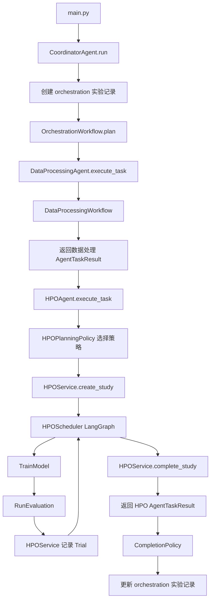

# ECAPA-TDNN 声纹识别优化运行路径与逐项检查手册

本文档基于当前源代码，描述使用 SpeechBrain ECAPA-TDNN 执行一次完整优化任务时的实际调用顺序、接口参数、状态转换、记录字段、文件位置与检查方法。

适用默认参数：

```text
task_type       = speaker_verification
model_family    = ecapa_tdnn
implementation  = speechbrain
runner          = speechbrain
primary_metric  = eer
metric_mode     = min
strategy        = auto
max_training_runs = 10
```

## 1. 启动命令

```powershell
python main.py `
  --config-path configs/train_ecapa_tdnn.yaml `
  --task-type speaker_verification `
  --model-family ecapa_tdnn `
  --implementation speechbrain `
  --runner speechbrain `
  --strategy auto `
  --max-iterations 10 `
  --data-iterations 6 `
  --objective "降低 ECAPA-TDNN 声纹验证 EER"
```

入口文件为 `main.py`。运行结束后标准输出只打印统筹实验 ID，例如：

```text
20260614_153000_0
```

后续检查应从该统筹实验 ID 开始。

## 2. 启动前检查

### 2.1 依赖检查

```powershell
python -c "import langgraph, langchain_core, hyperpyyaml, torch, torchaudio; print('dependencies ok')"
```

必须能够导入：

- `langgraph`
- `langchain_core`
- `hyperpyyaml`
- `torch`
- `torchaudio`
- `speechbrain`

### 2.2 配置文件检查

默认配置：

```text
configs/train_ecapa_tdnn.yaml
```

ECAPA 模型适配器要求配置至少包含：

```text
embedding_model
classifier
output_folder
```

训练前重点检查：

- `data_folder` 不应继续是不可用的 `!PLACEHOLDER`。
- `verification_file` 可访问。
- `output_folder`、`save_folder` 和 `train_log` 可写。
- `number_of_epochs`、`batch_size`、`lr` 可被 Trial 参数覆盖。
- CUDA、显存和磁盘空间满足训练要求。

### 2.3 适配器注册检查

当前默认注册项：

```text
TASK_ADAPTERS["speaker_verification"]
MODEL_ADAPTERS["ecapa_tdnn"]
RUNNER_ADAPTERS["speechbrain"]
```

对应接口：

```python
get_task_adapter("speaker_verification")
get_model_adapter("ecapa_tdnn")
get_runner_adapter("speechbrain")
```

任务适配器规定：

```text
primary_metric = eer
metric_mode    = min
```

## 3. 总体调用顺序



默认协调顺序由 `OrchestrationDecisionPolicy` 确定：

```text
data_processing_agent
hpo_agent
其他已注册智能体
```

LLM advisor 无权改变该顺序。

## 4. 第一层：统筹智能体

### 4.1 `CoordinatorAgent` 初始化

`main.py` 创建：

```python
CoordinatorAgent(
    config_path="configs/train_ecapa_tdnn.yaml",
    task_type="speaker_verification",
    model_family="ecapa_tdnn",
    implementation="speechbrain",
    runner="speechbrain",
    max_iterations=10,
    data_iterations=6,
)
```

默认注册两个专业智能体：

| agent_type | action | 实现 |
|---|---|---|
| `data_processing_agent` | `optimize_data_processing` | `DataProcessingAgent` |
| `hpo_agent` | `optimize_hyperparameters` | `HPOAgent` |

### 4.2 创建统筹实验

调用：

```python
ExperimentTracker(agent/experiments/manage).create_orchestration_experiment(...)
```

文件位置：

```text
agent/experiments/manage/<manage_experiment_id>/
├── config.yaml
└── experiment_record.json
```

创建后应检查 `experiment_record.json`：

```json
{
  "experiment_type": "orchestration",
  "schema_version": "2.0",
  "stage": "orchestration",
  "status": "created",
  "task": {
    "type": "speaker_verification",
    "dataset": "<resolved data_folder>",
    "primary_metric": "eer",
    "metric_mode": "min"
  },
  "model": {
    "family": "multi_agent_optimization",
    "implementation": "langgraph"
  },
  "execution": {
    "runner": "langgraph"
  },
  "linked_experiments": {},
  "agent_messages": []
}
```

### 4.3 传入协调图的状态

`CoordinatorAgent.run()` 构造：

```json
{
  "context": {
    "strategy": "auto",
    "target_goal": "validate and prepare the dataset",
    "primary_metric": "eer",
    "metric_mode": "min",
    "config_path": "<absolute config path>"
  },
  "budget": {
    "max_runs": 6,
    "max_training_runs": 10
  },
  "records": [],
  "latest_results": {}
}
```

### 4.4 协调图节点检查

调用顺序：

```text
START
  -> plan
  -> select_agent
  -> dispatch(data_processing_agent)
  -> select_agent
  -> dispatch(hpo_agent)
  -> select_agent
  -> complete
  -> END
```

每次 `dispatch` 都会生成：

- 一个 `task.request` 消息。
- 一个 `task.result` 或 `error` 消息。
- 一个 `TaskExecutionRecord`。

## 5. 智能体通信接口

### 5.1 `AgentTaskRequest`

协调器传给专业智能体的统一请求：

```json
{
  "action": "optimize_hyperparameters",
  "objective": "降低 ECAPA-TDNN 声纹验证 EER",
  "context": {
    "strategy": "auto",
    "primary_metric": "eer",
    "metric_mode": "min",
    "previous_results": {}
  },
  "budget": {
    "max_runs": 6,
    "max_training_runs": 10
  },
  "experiment_ids": {
    "manage": "<manage_experiment_id>",
    "data_processing": "<dp_experiment_id>"
  },
  "request_id": "request_<uuid>"
}
```

检查要求：

- `action` 必须属于注册表中该智能体允许的 action。
- `request_id` 在请求消息、结果消息和执行记录中一致。
- HPO 请求中应包含数据处理实验 ID。

### 5.2 `AgentTaskResult`

统一结果字段：

```json
{
  "status": "success",
  "summary": {},
  "metrics": {},
  "artifacts": [],
  "recommendations": [],
  "experiment_ids": {},
  "error": null,
  "request_id": "request_<uuid>"
}
```

### 5.3 `AgentMessage`

统筹实验最终保存的消息字段：

```json
{
  "session_id": "<manage_experiment_id>",
  "sender": "coordinator",
  "recipient": "hpo_agent",
  "message_type": "task.request",
  "payload": {},
  "correlation_id": "request_<uuid>",
  "reply_to": null,
  "status": "sent",
  "created_at": "<iso timestamp>",
  "message_id": "message_<uuid>"
}
```

结果消息应满足：

```text
correlation_id == 请求 request_id
reply_to        == 请求 message_id
```

## 6. 第二层：数据处理智能体

### 6.1 调用接口

```python
DataProcessingAgent.execute_task(request)
```

基类先校验：

```text
request.action == "optimize_data_processing"
```

之后调用：

```python
DataProcessingAgent.run_workflow(request)
```

### 6.2 数据处理 LangGraph 顺序

```text
START
  -> advise
  -> inspect
  -> plan
  -> execute
  -> publish 或 fail
  -> END
```

检查内容：

| 节点 | 接口 | 应产生的状态字段 |
|---|---|---|
| `advise` | 可选 LLM advisor | `advice`，失败只写 `advice_error` |
| `inspect` | `infer_dataset_spec`, `profile_dataset` | `profile` |
| `plan` | `build_processing_plan` | `plan` |
| `execute` | `execute_plan` | `results`, `route`, `error` |
| `publish` | `publish_dataset_version` | `published_version`, `status=success` |

### 6.3 数据处理记录位置

```text
agent/experiments/dp/<dp_experiment_id>/
├── config.yaml
├── experiment_record.json
└── dataset_versions/
    └── dataset_version.json
```

数据处理成功后检查：

```json
{
  "status": "success",
  "metrics": {
    "summary": {}
  },
  "artifacts": [
    {
      "type": "dataset_version",
      "name": "published_dataset",
      "path": "<dataset_version.json>"
    }
  ],
  "extensions": {
    "data_lifecycle": {
      "profile_before": {},
      "plan": {},
      "operation_results": [],
      "published_version": {},
      "recommendations": {}
    }
  }
}
```

重要现状：

> 数据处理结果通过 `summary.data_handoff` 传入协调上下文。HPO 必须校验 `consumption_status`，并将唯一的 `consumer_uri` 同时传给训练和评估。若处理产物不是完整可训练数据，状态为 `not_ready`，HPO 会失败而不会静默使用原始数据。

## 7. 第三层：HPO 智能体规划

### 7.1 HPO 请求入口

```python
HPOAgent.execute_task(request)
  -> LangGraphAgent.execute_task()
  -> HPOAgent.run_workflow(request)
```

动作校验：

```text
request.action == "optimize_hyperparameters"
```

### 7.2 默认搜索空间

未通过 `request.context.search_space` 指定时：

```json
{
  "parameters": [
    {
      "name": "lr",
      "parameter_type": "float",
      "low": 0.00001,
      "high": 0.01,
      "scale": "log"
    },
    {
      "name": "batch_size",
      "parameter_type": "categorical",
      "choices": [16, 32, 64]
    },
    {
      "name": "number_of_epochs",
      "parameter_type": "int",
      "low": 5,
      "high": 30
    }
  ],
  "constraints": []
}
```

### 7.3 默认预算

当 `strategy=auto` 且没有显式传入 budgets 时：

```json
[
  {"stage": "screening", "epochs": 3, "data_fraction": 0.25},
  {"stage": "promotion", "epochs": 8, "data_fraction": 0.5},
  {"stage": "confirmation", "epochs": 20, "data_fraction": 1.0}
]
```

### 7.4 `auto` 策略实际选择

`HPOPlanningPolicy` 规则：

```text
存在多个 budget rung 且 max_training_runs > 1
    -> successive_halving

否则，离散网格组合数 <= max_training_runs
    -> grid_search

否则，max_training_runs >= 5
    -> adaptive_search

否则
    -> random_search
```

因此默认 ECAPA-TDNN 示例会选择：

```text
successive_halving
```

### 7.5 创建 HPO 实验

位置：

```text
agent/experiments/hpo/<hpo_experiment_id>/
├── config.yaml
└── experiment_record.json
```

创建后应检查：

```json
{
  "experiment_type": "hpo",
  "status": "created",
  "stage": "optimization",
  "task": {
    "type": "speaker_verification",
    "dataset": "<resolved data_folder>",
    "primary_metric": "eer",
    "metric_mode": "min"
  },
  "model": {
    "family": "ecapa_tdnn",
    "implementation": "speechbrain",
    "config_path": "<absolute config path>"
  },
  "execution": {
    "runner": "speechbrain",
    "output_folder": "<resolved output folder>"
  }
}
```

### 7.6 创建 Study

调用：

```python
HPOService.create_study(...)
```

默认重要字段：

```json
{
  "strategy": "successive_halving",
  "objectives": [{"metric": "eer", "mode": "min", "weight": 1.0}],
  "initial_trial_count": 3,
  "promotion_limits": [1, 1],
  "max_trials": 10,
  "max_training_runs": 10,
  "min_completed_per_rung": 1,
  "status": "created",
  "best_trial_id": null
}
```

Study 文件：

```text
agent/experiments/hpo/<hpo_experiment_id>/hpo_study/study.json
```

Trial 文件目录：

```text
agent/experiments/hpo/<hpo_experiment_id>/hpo_study/trials/
```

## 8. 第四层：HPO LangGraph 执行

### 8.1 HPO 图顺序

```text
START
  -> advise
  -> suggest
  -> select_trial
  -> run_trial
  -> record_result
  -> select_trial / run_trial / promote / complete
  -> END
```

### 8.2 默认 successive-halving 预期运行数量

默认参数：

```text
initial_trial_count = 3
promotion_limits    = [1, 1]
budget rung 数量    = 3
```

预期创建：

```text
rung 0: 3 个初始 Trial
rung 1: 最多晋升 1 个 Trial
rung 2: 最多晋升 1 个 Trial
总计: 5 个 Trial
```

虽然 `max_training_runs=10`，默认 successive-halving 配额只会创建约 5 个 Trial；剩余运行额度不会自动补充新的 rung 0 候选。

### 8.3 Trial 状态转换

允许转换：

```text
suggested -> running / failed / stopped
running   -> completed / failed / stopped
completed -> promoted / failed
promoted  -> 终态
stopped   -> 终态
failed    -> 终态
```

失败重试是受控例外：

```text
failed -> suggested -> running
```

该转换只能通过：

```python
HPOService.retry_trial(...)
```

## 9. 单个 Trial 的详细调用顺序

### 9.1 Trial 初始记录

文件：

```text
agent/experiments/hpo/<hpo_experiment_id>/hpo_study/trials/<trial_id>.json
```

初始字段：

```json
{
  "trial_id": "trial_<uuid>",
  "parameters": {
    "lr": 0.001,
    "batch_size": 32,
    "number_of_epochs": 15
  },
  "budget": {
    "stage": "screening",
    "epochs": 3,
    "data_fraction": 0.25,
    "max_duration_seconds": null
  },
  "status": "suggested",
  "parent_trial_id": null,
  "rung": 0,
  "metrics": {},
  "intermediate_metrics": [],
  "cost": {},
  "artifacts": [],
  "stop_reason": null
}
```

### 9.2 Scheduler 标记运行

调用：

```python
HPOService.record_trial(study, trial_id, status="running")
```

检查：

```text
status == running
updated_at 已更新
```

### 9.3 调用训练工具

HPO 执行节点调用：

```python
TrainModel.invoke({
    "experiment_id": "<hpo_experiment_id>",
    "trial_id": "<trial_id>",
    "parameters_json": "{\"lr\": ..., \"batch_size\": ...}",
    "budget_json": "{\"stage\": ..., \"epochs\": ..., \"data_fraction\": ...}",
    "task_type": "speaker_verification",
    "model_family": "ecapa_tdnn",
    "implementation": "speechbrain",
    "runner": "speechbrain",
    "experiments_dir": "agent/experiments/hpo"
})
```

`TrainModel` 内部调用顺序：

```text
读取 HPO experiment_record.json
  -> 读取并解析 config.yaml
  -> get_task_adapter("speaker_verification")
  -> get_model_adapter("ecapa_tdnn")
  -> get_runner_adapter("speechbrain")
  -> SpeechBrainEcapaAdapter.validate_config
  -> 生成 Trial 独立输出目录
  -> 合并 Trial parameters 与 budget
  -> SpeechBrainRunnerAdapter.run_training
  -> agent.utils.runner.run_training
  -> 标准化 OperationResult
  -> ExperimentService.record_result
  -> HPOService.record_trial
```

### 9.4 训练参数覆盖

传给 Runner 的 `overrides`：

```json
{
  "data_folder": "<resolved data folder>",
  "output_folder": "agent/experiments/hpo/<id>/trials/<trial_id>/output",
  "lr": "<trial value>",
  "batch_size": "<trial value>",
  "number_of_epochs": "<budget epochs>",
  "_hpo_data_fraction": "<budget data_fraction>",
  "_hpo_max_duration_seconds": "<optional timeout>"
}
```

注意：

- Trial 参数中的 `number_of_epochs` 会被 budget 的 `epochs` 覆盖。
- `_hpo_data_fraction` 在 Runner 内被取出，用于训练数据子集。
- `_hpo_max_duration_seconds` 在 SpeechBrain Runner 外层控制独立进程超时。

### 9.5 训练输出目录

```text
agent/experiments/hpo/<hpo_experiment_id>/trials/<trial_id>/output/
├── train_log.txt
└── save/
    └── CKPT+...
```

### 9.6 训练 `OperationResult`

训练工具返回 JSON：

```json
{
  "status": "success",
  "stage": "training",
  "task": {
    "type": "speaker_verification",
    "dataset": "<data folder>",
    "primary_metric": "eer",
    "metric_mode": "min"
  },
  "model": {
    "family": "ecapa_tdnn",
    "implementation": "speechbrain",
    "config_path": "<config path>"
  },
  "execution": {
    "runner": "speechbrain",
    "output_folder": "<trial output>",
    "trial_id": "<trial_id>",
    "budget": {}
  },
  "metrics": {
    "validation": {
      "valid_error_rate": 0.0,
      "best_error_rate": 0.0
    }
  },
  "artifacts": [
    {
      "type": "checkpoint",
      "name": "<checkpoint name>",
      "path": "<checkpoint path>",
      "metadata": {"trial_id": "<trial_id>"}
    },
    {
      "type": "log",
      "name": "training_log",
      "path": "<train_log path>",
      "metadata": {"trial_id": "<trial_id>"}
    }
  ],
  "parameters": {},
  "extensions": {
    "speechbrain": {
      "output_folder": "<trial output>",
      "epoch_data": [],
      "final_metrics": {}
    }
  },
  "error": null,
  "experiment_id": "<hpo_experiment_id>"
}
```

训练成功后，Trial 会先被写为 `completed`，并记录：

```text
metrics              <- 训练 validation 指标
intermediate_metrics <- epoch_data
cost.duration_seconds
artifacts            <- checkpoint、training_log
```

### 9.7 调用评估工具

训练成功后调用：

```python
RunEvaluation.invoke({
    "experiment_id": "<hpo_experiment_id>",
    "trial_id": "<trial_id>",
    "experiments_dir": "agent/experiments/hpo",
    "runner": "speechbrain"
})
```

评估调用顺序：

```text
读取 HPO experiment_record.json
  -> 按 trial_id 从 artifacts 精确选择 checkpoint
  -> get_runner_adapter("speechbrain")
  -> get_task_adapter("speaker_verification")
  -> 使用 configs/verification_ecapa.yaml
  -> SpeechBrainRunnerAdapter.run_evaluation
  -> agent.utils.runner.run_evaluation
  -> 校验 eer/min_dcf 为数值
  -> 标准化 OperationResult
  -> ExperimentService.record_result
  -> HPOService.record_trial
```

评估产物目录：

```text
agent/experiments/hpo/<hpo_experiment_id>/evaluation/<trial_id>/
├── log.txt
└── <scores file, 如果 Runner 产生>
```

评估结果关键字段：

```json
{
  "status": "success",
  "stage": "evaluation",
  "metrics": {
    "test": {
      "eer": 0.03,
      "min_dcf": 0.12
    }
  },
  "execution": {
    "runner": "speechbrain",
    "trial_id": "<trial_id>",
    "output_folder": "<evaluation trial dir>"
  },
  "parameters": {
    "model_path": "<trial checkpoint>",
    "data_path": "<data folder>"
  }
}
```

### 9.8 Scheduler 最终同步 Trial

评估返回后，Scheduler 再次调用：

```python
HPOService.record_trial(
    status="completed",
    metrics={"eer": ..., "min_dcf": ...},
    cost={"attempts": ...},
    artifacts=[...],
)
```

同状态 `completed -> completed` 被允许，用于补充最终测试指标与产物。

最终 Trial 至少应包含：

```json
{
  "status": "completed",
  "metrics": {
    "valid_error_rate": 0.0,
    "eer": 0.03,
    "min_dcf": 0.12
  },
  "cost": {
    "duration_seconds": 100.0,
    "attempt": 1,
    "attempts": 1
  },
  "artifacts": [],
  "stop_reason": null
}
```

## 10. 晋升检查

successive-halving 只比较同一 rung 的 Trial。

晋升条件：

```text
Trial.status == completed
当前 rung 不是最后一级
同 rung completed 数量 >= min_completed_per_rung
目标 rung 数量未超过 promotion_limits
remaining_training_runs > 0
```

被晋升源 Trial：

```text
status = promoted
```

新 Trial：

```json
{
  "status": "suggested",
  "parent_trial_id": "<source trial id>",
  "rung": 1,
  "parameters": "<复制源 Trial 参数>",
  "budget": "<下一 rung 预算>"
}
```

## 11. Study 完成检查

调用：

```python
HPOService.complete_study(study, "langgraph_completed")
```

成功完成必须同时满足：

- 至少存在一个 `completed` 或 `promoted` Trial。
- 该 Trial 的主指标 `eer` 是有效数值。
- 不存在 `suggested` 或 `running` Trial。
- `best_trial_id` 非空。

成功后的 `study.json`：

```json
{
  "status": "completed",
  "stop_reason": "langgraph_completed",
  "best_trial_id": "<best trial id>"
}
```

如果不满足，Study 会被写为：

```text
status = failed
stop_reason = 具体完成条件错误
```

## 12. HPO 实验最终记录

文件：

```text
agent/experiments/hpo/<hpo_experiment_id>/experiment_record.json
```

成功后重点检查：

```json
{
  "status": "success",
  "stage": "evaluation",
  "duration_seconds": 0,
  "actor": {
    "type": "hpo_agent",
    "name": "model_evaluator"
  },
  "task": {
    "type": "speaker_verification",
    "primary_metric": "eer",
    "metric_mode": "min"
  },
  "model": {
    "family": "ecapa_tdnn",
    "implementation": "speechbrain"
  },
  "execution": {
    "runner": "speechbrain",
    "trial_id": "<last recorded trial id>"
  },
  "metrics": {
    "validation": {},
    "test": {},
    "best": {}
  },
  "parameters": {
    "<best parameter>": "<value>"
  },
  "artifacts": [],
  "extensions": {
    "optimization": {
      "workflow": "langgraph",
      "strategy": "successive_halving",
      "recommendations": {},
      "study": {},
      "trials": [],
      "trial_summary": [],
      "latest_trial_execution": {}
    },
    "speechbrain": {}
  },
  "error": null
}
```

说明：

- `ExperimentService.record_result()` 会不断合并训练和评估记录。
- `metrics` 按 `validation`、`test`、`best` 等 split 合并。
- `artifacts` 按 `(type, name, path)` 去重。
- `extensions` 使用深度合并。
- `stage`、`actor`、`execution.trial_id` 可能反映最后一次写入操作，而不是全局最佳 Trial；全局最佳应以 `extensions.optimization.study.best_trial_id` 为准。

## 13. HPO Agent 返回结果

HPO 智能体返回给协调器：

```json
{
  "status": "success",
  "summary": {
    "strategy": "successive_halving",
    "best_trial_id": "<trial id>",
    "best_parameters": {},
    "study": {},
    "trials": []
  },
  "metrics": {
    "eer": 0.03,
    "min_dcf": 0.12
  },
  "recommendations": [],
  "artifacts": [],
  "experiment_ids": {
    "hpo": "<hpo_experiment_id>"
  },
  "error": null,
  "request_id": "<original request_id>"
}
```

## 14. 统筹完成检查

`CompletionPolicy` 默认要求：

```text
data_processing_agent 成功
hpo_agent 成功
不存在失败任务
```

最终统筹记录：

```text
agent/experiments/manage/<manage_experiment_id>/experiment_record.json
```

重点字段：

```json
{
  "status": "success",
  "linked_experiments": {
    "manage": ["<manage_experiment_id>"],
    "data_processing": ["<dp_experiment_id>"],
    "hpo": ["<hpo_experiment_id>"]
  },
  "agent_messages": [],
  "extensions": {
    "orchestration": {
      "workflow": "langgraph",
      "advice": {},
      "task_results": [],
      "completion": {
        "complete": true,
        "status": "success",
        "reasons": []
      }
    }
  }
}
```

## 15. 记忆记录检查

成功运行会向以下文件追加 JSONL：

```text
agent/memory/episodes.jsonl
```

HPO Episode 关键字段：

```json
{
  "agent_type": "hpo_agent",
  "objective": "降低 ECAPA-TDNN 声纹验证 EER",
  "action": {
    "strategy": "successive_halving",
    "best_config": {}
  },
  "outcome": {
    "best_metrics": {},
    "recommendations": {}
  },
  "experiment_ids": ["<hpo_experiment_id>"],
  "scope": {
    "task_type": "speaker_verification",
    "model_family": "ecapa_tdnn",
    "dataset_key": "<data folder>"
  },
  "status": "success",
  "importance": 0.9
}
```

## 16. 失败与重试检查

失败分类：

| 类别 | 常见标记 | 是否可恢复 |
|---|---|---|
| `configuration` | config、not found、invalid、unsupported、missing | 否 |
| `timeout` | timeout | 是 |
| `resource` | out of memory、cuda | 是 |
| `transient` | connection、worker、temporar | 是 |
| `execution` | 其他错误 | 否 |

可恢复错误且未超过 `max_retries`、仍有训练额度时：

```text
failed -> suggested -> running
cost.retry_count += 1
```

最终失败 Trial 应检查：

```json
{
  "status": "failed",
  "cost": {
    "attempts": 1,
    "failure_category": "configuration",
    "recoverable": false
  },
  "stop_reason": "<error text>"
}
```

## 17. 逐项运行检查表

### 17.1 统筹层

- [ ] `main.py` 输出了 manage experiment ID。
- [ ] manage `experiment_record.json` 存在。
- [ ] `registered_agents` 包含数据处理和 HPO 智能体。
- [ ] `agent_messages` 中每个请求都有对应结果。
- [ ] 请求与结果的 `correlation_id/request_id` 一致。
- [ ] `linked_experiments` 包含 manage、data_processing、hpo。

### 17.2 数据处理层

- [ ] DP 实验状态从 `created` 变为 `running`，最终为 `success`。
- [ ] `dataset_version.json` 存在。
- [ ] `extensions.data_lifecycle.profile_before` 存在。
- [ ] `extensions.data_lifecycle.plan` 存在。
- [ ] 所有 `operation_results.status` 均非 `failed`。
- [ ] 发布版本的 `quality_metrics` 合理。
- [ ] HPO 实际使用的数据目录与预期数据版本一致。

### 17.3 HPO Study

- [ ] HPO 实验记录存在。
- [ ] `hpo_study/study.json` 存在。
- [ ] `strategy` 与请求或 `auto` 规则一致。
- [ ] `objectives[0] == {"metric": "eer", "mode": "min", ...}`。
- [ ] `initial_trial_count`、`promotion_limits`、`max_training_runs` 正确。
- [ ] `trial_ids` 与 trials 目录文件数一致。

### 17.4 每个 Trial

- [ ] 参数均落在搜索空间内。
- [ ] Trial 状态转换合法。
- [ ] 独立输出目录存在。
- [ ] checkpoint artifact 的 `metadata.trial_id` 正确。
- [ ] 评估选择的是同一个 Trial 的 checkpoint。
- [ ] `metrics.eer` 为数值。
- [ ] `cost.duration_seconds`、`attempts` 合理。
- [ ] 失败 Trial 包含 `failure_category`、`recoverable` 和 `stop_reason`。

### 17.5 Study 完成

- [ ] 不存在 `suggested` 或 `running` Trial。
- [ ] 至少一个有效 completed/promoted Trial。
- [ ] `best_trial_id` 指向真实 Trial 文件。
- [ ] best Trial 的 `eer` 等于所有有效 Trial 中最小值。
- [ ] Study `status == completed`。
- [ ] HPO experiment `status == success`。

### 17.6 最终统筹结果

- [ ] `completion.complete == true`。
- [ ] `completion.status == success`。
- [ ] `task_results` 中两个默认智能体均为 `success`。
- [ ] `agent/memory/episodes.jsonl` 写入数据处理、HPO 和统筹 Episode。

## 18. 常用检查命令

列出最近统筹实验：

```powershell
Get-ChildItem agent\experiments\manage | Sort-Object LastWriteTime -Descending | Select-Object -First 5
```

查看统筹记录：

```powershell
Get-Content agent\experiments\manage\<manage_id>\experiment_record.json
```

查看关联实验 ID：

```powershell
Get-Content agent\experiments\manage\<manage_id>\experiment_record.json |
  ConvertFrom-Json |
  Select-Object -ExpandProperty linked_experiments
```

查看 Study：

```powershell
Get-Content agent\experiments\hpo\<hpo_id>\hpo_study\study.json
```

列出 Trial 状态：

```powershell
Get-ChildItem agent\experiments\hpo\<hpo_id>\hpo_study\trials\*.json |
  ForEach-Object { Get-Content $_ | ConvertFrom-Json } |
  Select-Object trial_id, status, rung, parent_trial_id, metrics, cost, stop_reason
```

检查仍未终止的 Trial：

```powershell
Get-ChildItem agent\experiments\hpo\<hpo_id>\hpo_study\trials\*.json |
  ForEach-Object { Get-Content $_ | ConvertFrom-Json } |
  Where-Object { $_.status -in @("suggested", "running") }
```

检查 Trial checkpoint：

```powershell
Get-ChildItem agent\experiments\hpo\<hpo_id>\trials -Recurse
```

查看最终记忆：

```powershell
Get-Content agent\memory\episodes.jsonl | Select-Object -Last 10
```

## 19. 当前实现中需要重点观察的边界

1. 数据处理产物只有在 `consumption_status=ready` 时才会替换 HPO 数据路径；仅生成局部产物时必须进一步物化完整数据集。
2. 默认 successive-halving 不一定耗尽 `max_training_runs`。
3. 训练成功后 Trial 会先标记 `completed`，评估和 Scheduler 随后继续补充同一 Trial。
4. HPO 实验顶层 `stage`、`actor` 和 `execution.trial_id` 可能反映最后写入操作；全局最优信息以 Study 为准。
5. `recommendations` 是只读建议，不会自动修改当前 Study。
6. 运行 `grid_search` 时，连续浮点参数必须改为离散 `choices`，否则服务层会拒绝创建 Study。
7. 若搜索空间包含新的 `model_family` 或 `runner`，必须先注册对应适配器。
